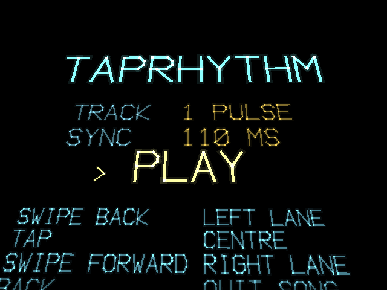
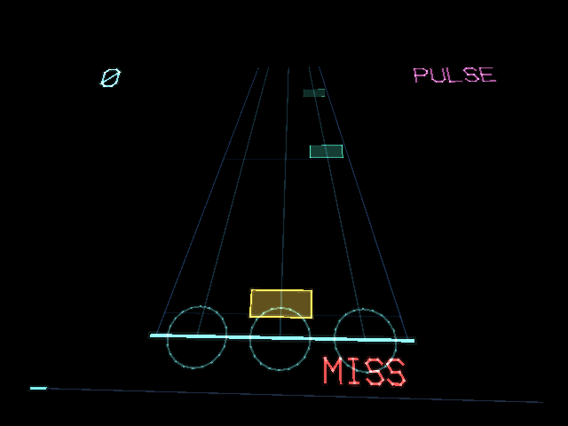

# TapRhythm

TapRhythm is a three-lane rhythm game built for the RayNeo X3 Pro smart glasses, designed around the idea that a temple touchpad's three unambiguous inputs — a tap and a swipe in either direction — are a natural fit for a genre built on hitting a small number of targets with precise timing. Notes travel toward the player from the far end of a stereo-rendered board rather than falling down a flat screen, so approach speed reads as real spatial urgency. The five included tracks and their note charts were chosen and generated by analyzing tempo, beat strength, and onset density offline, and the game's timing windows and audio-sync offset were tuned specifically for a fingertip gesture on the side of the head rather than a rigid handheld controller.

## Screenshots

  
  

## Controls

- Swipe back — hit the left lane
- Tap — hit the center lane
- Swipe forward — hit the right lane
- Double tap — abandon the song

## Download

[taprhythm.apk](taprhythm.apk)
